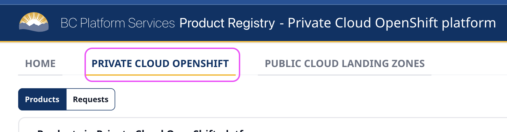

# Product registry 

The BC Platform Services [Product Registry](https://registry.developer.gov.bc.ca/) (often abbreviated to 'the registry') is a directory of all the active products in OpenShift and the BC Gov's Public Cloud offerings. 

## Purpose of the registry

The registry links the people responsible for maintaining the software product with the set of namespaces where the computing work is done. Since these are usually just alphanumeric codes, it's much easier to be prompted about the name of the project and people involved instead of just a set characters such as `d8f105-dev`. This helps the Platform Services Team to identify the key contacts for each product and how to reach them when needed. 

## The provisioner 

The registry isn't just a list of contact information. It can interact with OpenShift via an internal tool called 'the provisioner' to perform tasks such as: 
- Managing administrator access 
- Adjusting resource quotas for CPU, RAM and storage
- Creating and deleting products and their associated namespaces in OpenShift  

In short, changes made in the registry can trigger changes in OpenShift. 

## Contact details

The product owner and technical leads listed in the registry will have `admin` access to your OpenShift namespaces. They can then [grant access](https://developer.gov.bc.ca/docs/default/component/platform-developer-docs/docs/openshift-projects-and-access/grant-user-access-openshift/) to other developers on your team. 

It is important to keep these details up to date so that this access is issued appropriately, and so that your team can be contacted. 


## Create a temporary product set 

- Go to [https://registry.developer.gov.bc.ca/](https://registry.developer.gov.bc.ca/)
- Click on the 'Private Cloud OpenShift' tab
<kbd></kbd>
- Click 'Request a new product' in the top right corner of the window
<kbd></kbd>
- In the product description set the following items: 
```
Temporary Product Set: checked
Product name: OpenShift 101 Training
Product description: Training product set 
Ministry: *choose your ministry*
Hosting tier: GOLD
```
- In the team members section, use emails to assign the users as follows:
```
Product owner (PO): Your BC Gov email
Primary Technical Lead (TL): matt.spencer@gov.bc.ca
Secondary Technical Lead (TL): billy.li@gov.bc.ca
```
Admin access to your namespace is automatically granted to the product owner and technical leads. It is important to keep these up to date as people join or leave your team. The product owner should always be the BC Gov employee responsible for the project rather than a contractor.

- Submit your product set request. Temporary product sets are automatically approved. Permanent product sets would normally go through an onboarding meeting and approval process. 

- After your request is submitted, the provisioner will begin interacting with OpenShift to create your product set and grant the necessary access. This may take a few minutes.

## Quota change

Once your product set has been created, let's edit some of the resources. If you needed additional CPU, memory or storage resources, this may require review and explanation to ensure resources are allocated efficiently. 

Each product set comes with four 'namespaces' - development (dev), test, tools and production (prod). In this training, we don't use the production or test namespaces. We'll set their resource values to 0. 
- Click on your product set in the 'products' list in the registry
- Scroll down and click the `Quotas(request)` section
- We'll leave 'development' and 'tools' at the default values
- Edit the test namespace and production namespace to these values:
```
Test
CPU(core): 0
Memory(GiB): 0
Storage(GiB): 0
Production
CPU(core): 0
Memory(GiB): 0
Storage(GiB): 0
```
- Submit the edit 

