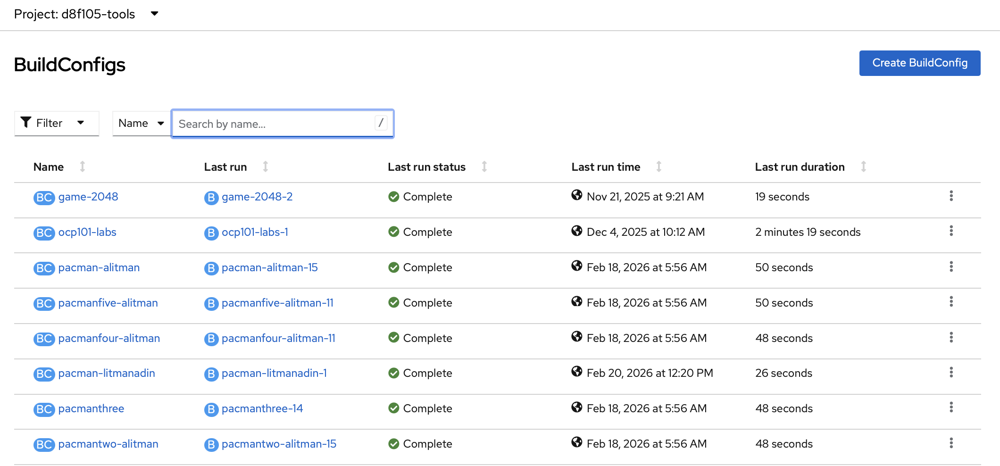
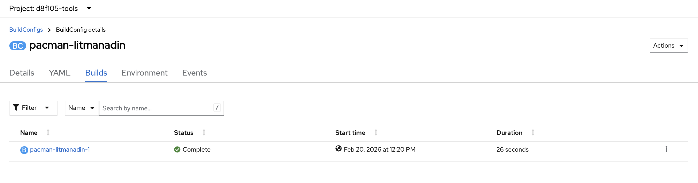

# Builds
In this lab, you will build the Pac-Man application image for use in your OpenShift environment. We will build Pac-Man from source using Source-to-Image (S2I).

<!-- <kbd>[](https://youtu.be/j7a74_I6MYw)<kbd>

[Video walkthrough](https://youtu.be/j7a74_I6MYw) -->

## The Tools Project
The tools project is what will hold various support tools for the application. In this case, we'll build the Pac-Man image in this project and then tag it for use in dev. Building in tools helps preserve CPU/memory quotas in your dev namespace for deployment workloads.

## Importing the Pac-Man Image
The Pac-Man source code is available on a Github [public repository](https://github.com/RHODA-lab/pacman).

Leveraging the commandline, you can use the `oc new-build` command to create all of the necessary OpenShift build components. 

Ensure that all team members have edit rights into the project. Once complete, 
each member can create their own Pac-Man build. 

**Note:** In this lab, we'll use square brackets to indicate when you need to replace part of a command and omit the square brackets. If you see `[-tools]` in a command, replace that part of the command with the name of your tools namespace. When `[-dev]` is indicated, replace this part of the command with your dev namespace's name. In the example below, `oc project [-tools]` would become `oc project d8f105-tools` or the name of the tools namespace you are using for this training. We also use [username] as a unique identifier throughout the lab, and this can be any unique username so long as you use it consistently throughout the lab. Note that this username cannot contain the following characters: `. ~ @ | ></{}[];:'"`

- To start, switch to the __Tools Project__

```
oc project [-tools]
```

- With the `oc` cli, create a BuildConfig for Pac-Man:

```oc:cli
oc -n [-tools] new-build https://github.com/RHODA-lab/pacman \
    --name=pacman-[username] \
    --to=pacman-[username]:8.0.1
```

- The output of the previous command should be similar to the following: 

```
--> Found image 5cce4e1 (2 days old) in image stream "openshift/nodejs" under tag "20-ubi9" for "nodejs"

    Node.js 20 
    ---------- 
    Node.js 20 available as container is a base platform for building and running various Node.js 20 applications and frameworks. Node.js is a platform built on Chrome's JavaScript runtime for easily building fast, scalable network applications. Node.js uses an event-driven, non-blocking I/O model that makes it lightweight and efficient, perfect for data-intensive real-time applications that run across distributed devices.

    Tags: builder, nodejs, nodejs20

    * The source repository appears to match: nodejs
    * A source build using source code from https://github.com/RHODA-lab/pacman will be created
      * The resulting image will be pushed to image stream tag "pacman-[username]:8.0.1"
      * Use 'oc start-build' to trigger a new build

--> Creating resources with label build=pacman-[username] ...
    imagestream.image.openshift.io "pacman-[username]" created
    buildconfig.build.openshift.io "pacman-[username]" created
--> Success
```

- Follow the build logs. The build may take a few minutes to complete:

```oc:cli
oc -n [-tools] logs -f bc/pacman-[username]
```

You can now explore the Web Console to watch the build status from `Builds`. Note that you will see multiple builds from each team member. 

<kbd></kbd>

- Or this can be done on the CLI

```oc:cli
oc -n [-tools] get bc
oc -n [-tools] status
```

- The build status can be monitored from the Web Console by selecting the `Logs` link

<kbd></kbd>

<kbd></kbd>

- Note: The "an error occured while retrieving the requested logs" message can be ignored.

Next page - [Deployment](./03_deployment.md)
